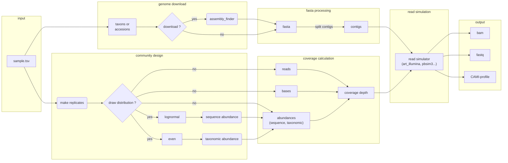

# Metagenomic Sequence Simulator (MeSS)

[](https://github.com/beardymcjohnface/Snaketool)
[](https://github.com/metagenlab/MeSS/blob/main/LICENSE)
[](http://bioconda.github.io/recipes/mess/README.html)
[](https://anaconda.org/bioconda/mess)

[](https://github.com/metagenlab/MeSS/actions/workflows/unit-tests.yml)
[](https://github.com/metagenlab/MeSS/actions/workflows/build-docs.yml)
[](https://github.com/metagenlab/MeSS/actions/workflows/docker-publish.yml)

[](https://zenodo.org/doi/10.5281/zenodo.13365501)


The Metagenomic Sequence Simulator (MeSS) is a [Snakemake](https://github.com/snakemake/snakemake) pipeline, implemented using [Snaketool](https://github.com/beardymcjohnface/Snaketool), for simulating illumina, Oxford Nanopore (ONT) and Pacific Bioscience (PacBio) shotgun metagenomic samples.

## :memo: Overview

MeSS takes as input NCBI taxa or local genome assemblies to generate either long (PacBio or ONT) or short (illumina) reads. In addition to reads, MeSS optionally generates bam alignment files and taxonomic + sequence abundances in [CAMI format](https://github.com/bioboxes/rfc/blob/master/data-format/profiling.mkd).


## :books: Documentation 

More details can be found in the [documentation](https://metagenlab.github.io/MeSS/)

## :zap: Quick start 
### Installation

#### Mamba

[](http://bioconda.github.io/recipes/mess/README.html)

```sh
mamba create -n mess mess
```

#### Docker

```sh
docker pull ghcr.io/metagenlab/mess:latest
```

#### From source 

```sh
git clone https://github.com/metagenlab/MeSS.git
pip install -e MeSS
```

### Usage


#### Download and simulate

Using the following file [minimal_test.tsv](https://github.com/metagenlab/MeSS/blob/main/mess/test_data/minimal_test.tsv)

```sh
mess run -i minimal_test.tsv 
```

#### Simulate from local fasta

Download the [fasta directory](https://github.com/metagenlab/MeSS/tree/main/mess/test_data/fastas) and [table](https://github.com/metagenlab/MeSS/blob/main/mess/test_data/simulate_test.tsv)

```sh
mess simulate -i simulate_test.tsv --fasta fasta 
```

## :sos: Help

More details on command-line options in the [doc](https://metagenlab.github.io/MeSS/commands/)


