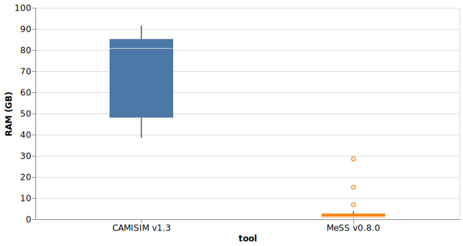
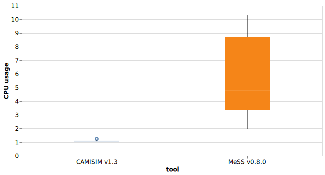
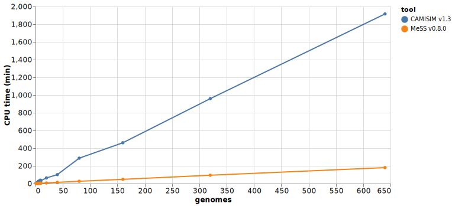

16 samples were used to benchmark MeSS and CAMISIM resources usage. 

Samples were create by subsampling 1, 2, 3, 4, 5, 6, 7, 8, 9, 10, 20, 40, 80, 160, 320, 640 genomes from a total of 2000 complete bacterial genomes (downloaded with [assembly_finder](https://github.com/metagenlab/assembly_finder)). 

Each genome was covered at 1x using art_illumina with CAMISIM's custom MBARC error model.

See [this nextflow pipeline](https://github.com/farchaab/benchmark-MeSS-CAMISIM) to run the benchmark.
## Results
### Physical RAM usage

### CPU usage

###  CPU time

!!! warning
    To simulate a sample with 2.4G base pairs, using one CPU, CAMISIM takes 32 hours, while MeSS takes 3 hours.
    
## Conclusions
MeSS vs CAMISIM on average:

- [x] 5x more parallel (CPU usage)
- [x] 10x faster using one CPU (CPU time)
- [x] Uses 16.7x less memory (physical RAM)