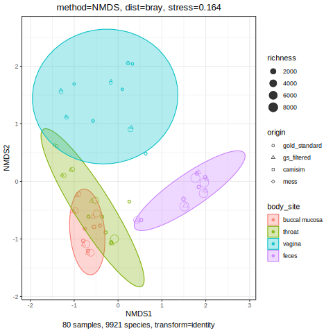

5 samples from the [human microbiome project](https://www.hmpdacc.org/hmp/) were were classified with [kraken2](https://github.com/DerrickWood/kraken2) and [bracken](https://github.com/jenniferlu717/Bracken). Taxa with at least at 200 reads were kept and used as input to both MeSS and CAMISIM.

Use [this nextflow pipeline](https://github.com/farchaab/benchmark-MeSS-CAMISIM) to generate the fastqs. 

## Results

[microViz](https://github.com/david-barnett/microViz/) was used for the ordination plots and statistical tests.

### Bray-curtis



:material-arrow-right: Samples from the same bodysite cluster together. In addition, simulated samples cluster well with real samples (gold_standard and gs_filtered).

### PERMANOVA

:simple-hypothesis: **Null hypothesis** : No significant difference in species composition between simulated and non simulated samples

??? info "**Code**"
    ```R
    perm <- dist_permanova(mdist,
        variables = "origin:simulated+body_site",
        n_perms = 999, 
        n_processes = 3
    )
    ```

```R
                 Df SumOfSqs      R2       F Pr(>F)
body_site         3   12.153 0.37843 15.6933  0.001 ***
origin:simulated  3    1.117 0.03479  1.4429  0.067 .
Residual         73   18.844 0.58678
Total            79   32.115 1.00000
```

:material-arrow-right: Significant difference between body sites. No significant difference between simulated and real samples

### Beta dispersion

:simple-hypothesis: **Null hypothesis** : No significant difference in dispersion between samples of different origin

```R
Fit: aov(formula = distances ~ group, data = df)

$group
                                   diff         lwr        upr     p adj
gs_filtered-gold_standard  2.249163e-03 -0.03593552 0.04043384 0.9986690
camisim-gold_standard     -2.310968e-02 -0.06129435 0.01507500 0.3905351
mess-gold_standard        -2.308946e-02 -0.06127414 0.01509522 0.3913195
camisim-gs_filtered       -2.535884e-02 -0.06354352 0.01282584 0.3082419
mess-gs_filtered          -2.533862e-02 -0.06352330 0.01284606 0.3089344
mess-camisim               2.021632e-05 -0.03816446 0.03820490 1.0000000
```

:material-arrow-right: No significant difference between filtered and non-filtered samples, simulated and real samples.

## Conclusions

- [x] Same species composition between original and filtered samples
- [x] Same species composition between MeSS and CAMISIM

