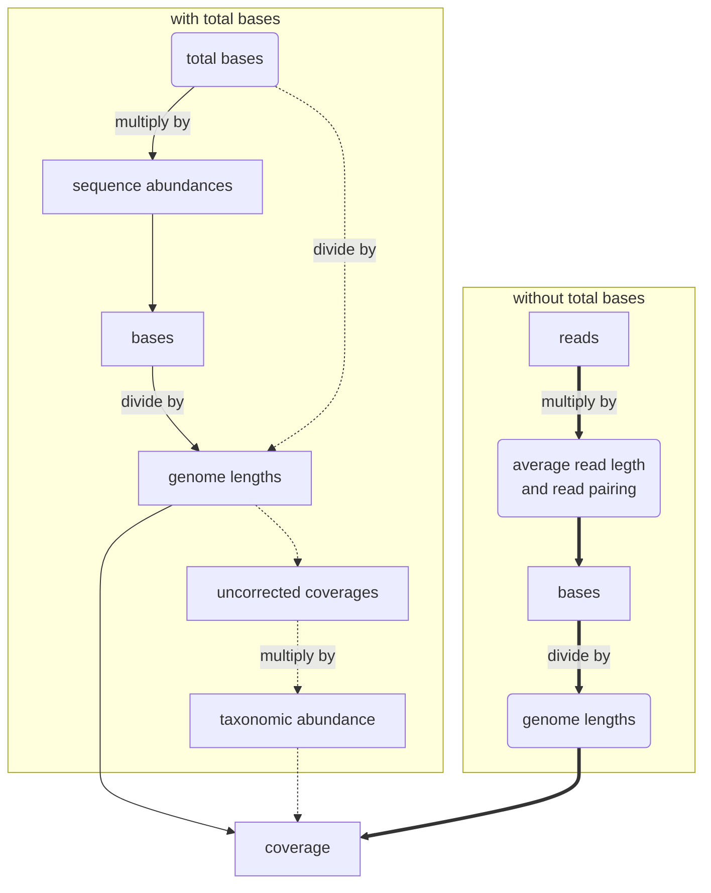

Before generating reads, `mess` calculates coverage depths for each genome according to values in the input table or a distribution set by the user.

## Coverage calculation

### From input table values

If sequence or taxonomic abundance is set, coverage is calculated starting from the total amount of base pairs per sample (set by `--bases`). If using reads and abundances, `--bases` is ignored, and the total amount of bases is calculated from the input table.

>:material-arrow-right: Path using sequence abundance

>**---**> Path using taxonomic abundance

>:material-arrow-right-bold: Path using reads or bases

!!! example
    === "bases"

        | taxon                  | genome_size  | bases    |
        | :--------------------- | :-- | :------- |
        | 1280  | 2821361   | 28213610 |
        | pseudomonas_aeruginosa | 6264404   | 62644040 |

    === "reads"

        | taxon                  | genome_size  | reads  |
        | :--------------------- | :-- | :----- |
        | 1280  | 2821361   | 94045  |
        | pseudomonas_aeruginosa | 6264404   | 208813 |

    === "tax_abundance"

        | taxon                  | genome_size  | tax_abundance  |
        | :--------------------- | :-- | :----- |
        | 1280  | 2821361   | 0.5  |
        | pseudomonas_aeruginosa | 6264404   | 0.5 |

    === "seq_abundance"

        | taxon                  | genome_size  | seq_abundance  |
        | :--------------------- | :-- | :----- |
        | 1280  | 2821361   | 0.32  |
        | pseudomonas_aeruginosa | 6264404   | 0.68 |
    
    === "coverage"

        | taxon                  | genome_size  | cov_sim |
        | :--------------------- | :-- | :------ |
        | 1280  | 2821361   | 10      |
        | pseudomonas_aeruginosa | 6264404  | 10      |

### From distributions
#### Even distribution
If you want to have taxonomic abundances envenly distributed between genomes with the same taxonomic rank or tax_id, set `--dist even`.

For example, if you have 10 genomes with 10 different taxonomic ranks or ids, each genome will have a tax_abundance of 1/10.
#### Log normal
If you set `--dist lognormal`, each genome will be assigned a random taxonomic abundance following a lognormal distribution.
You can control the shape of the curve by modifying the `--mu` and `--sigma` parameters (0 and 1 by default repsectively).
  

>By Xenonoxid - Own work, CC BY-SA 4.0, https://commons.wikimedia.org/w/index.php?curid=114726542

## Replicates

If replicates are set with`--replicates`, the same coverage values will be applied for each replicate. If you want variablitiy between replicates, you can increase the standard deviation with `--rep-sd`.