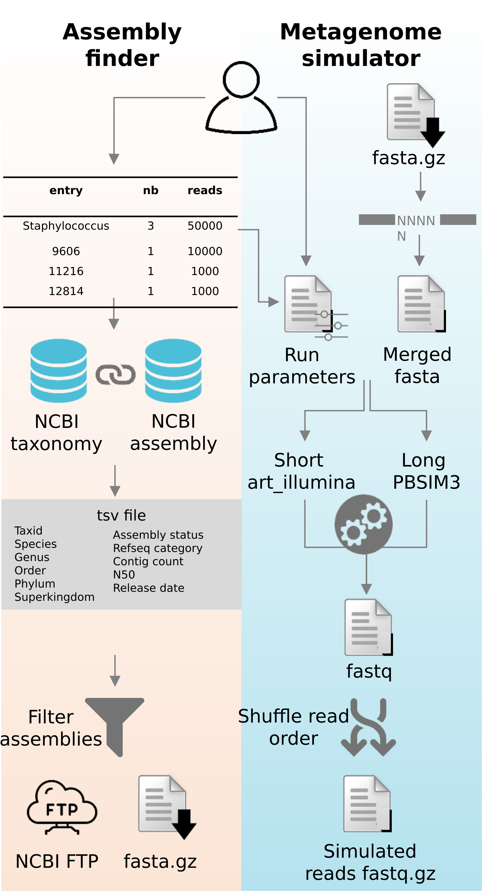

# Welcome to `MeSS` !

MeSS is a Snakemake pipeline, implemented using [Snaketool](https://github.com/beardymcjohnface/Snaketool), for simulating illumina, Oxford Nanopore (ONT) and Pacific Bioscience (PacBio) shotgun metagenomic samples.

## Overview

`MeSS` makes metagenomic sample generation easy !

It automates tasks such as community design, genome download and read simulation in parallel and in a scalable fashion. It takes as input NCBI or local genome assemblies to generate either long (PacBio or ONT) or short (illumina) reads.
In addition to fastq files, MeSS optionally generates bam files that indicate the genomic region from which the reads were sampled from. This is useful to evaluate sequencing errors and have a ground truth dataset of the samples taxonomic profile.

- Genomes are downloaded using [`assembly_finder`](https://github.com/metagenlab/assembly_finder)

- Short reads (illumina) are simulated by [`art`](https://www.niehs.nih.gov/research/resources/software/biostatistics/art)
- Long reads (PacBio or ONT) are simulated by [`pbsim3`](https://github.com/yukiteruono/pbsim3)

- Reads are shuffled using [`seqkit`](https://github.com/shenwei356/seqkit)
